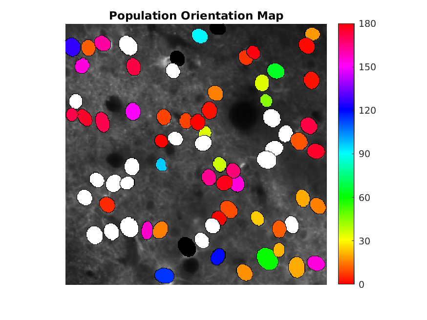

## Visual Neuroscience: Analyzing Neural Response Properties

This repository contains the work done as part of a project to analyze the response of neurons to visual stimulation in the primary visual cortex of a mouse brain, under the Quantitative Biolgy Workshop conducted by MITx. 

First, ImageJ was used to process a raw TIF file containing a time-lapse of neurons firing in response to drifting gratings presented at various different orientations to the subject. The mean fluorescence values of the neurons over this time period were obtained here.

Next, MATLAB was used to determine which orientations of the grating each neuron was most responsive to. This was done by quantifying the response of the neurons to each orientation by constructing an orientation tuning curve, first defining a baseline fluoresence to demarcate ON and OFF periods.

Finally, this curve was used to measure the preferred orientation as well as the orientation selectivity index of each neuron (the degree to which a neuron is selective in its response to differing orientations of the image). The resulting data is presented in the form of the final population map, which demonstrates the relationship between the orientation tuning and location of the neuron in the brain.

